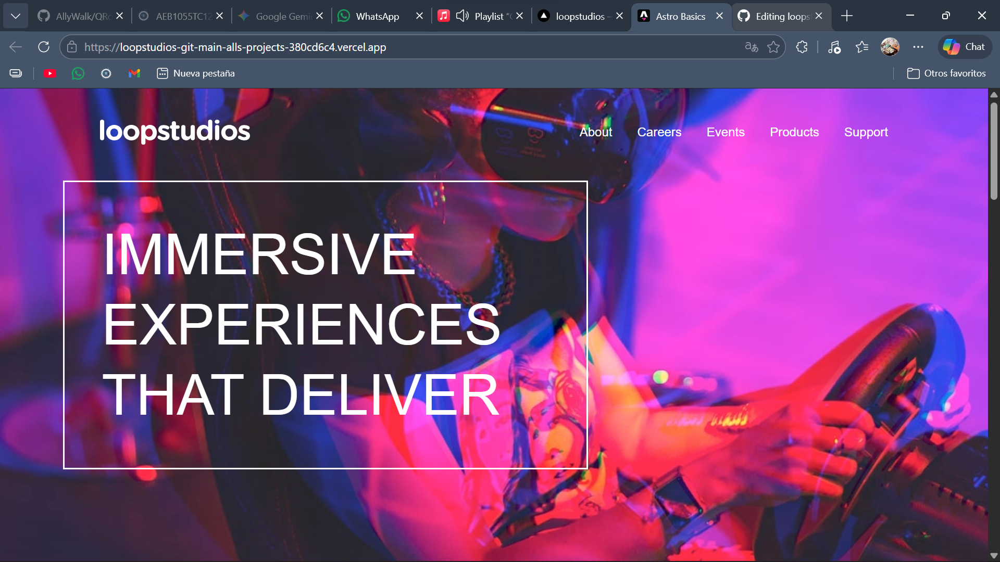

# 🏝️ Proyecto: Loopstudios Landing Page

Este proyecto consiste en el desarrollo de la **landing page de Loopstudios** utilizando **Astro** y **Tailwind CSS**.  
El objetivo es aplicar los conocimientos sobre **componentes de Astro**, **maquetación**, **estilos responsivos** y **utilidades CSS** para construir un diseño limpio, moderno y adaptable a diferentes dispositivos.

---

## 📖 Descripción general

### 🧩 Vista previa del proyecto
Agrega aquí una **captura de pantalla** del resultado final de tu landing page.  

---

### 🔗 Enlaces del proyecto

- **Repositorio en GitHub:** [Agrega aquí la URL de tu repositorio]((https://github.com/AllyWalk/loopstudios))
- **Sitio desplegado (opcional):** [Agrega aquí la URL del proyecto desplegado, si usaste Vercel o Netlify](https://loopstudios-git-main-alls-projects-380cd6c4.vercel.app/)

---

## 🧠 Proceso de desarrollo

### 🛠️ Tecnologías utilizadas
Lista las herramientas y tecnologías que utilizaste en el proyecto. Por ejemplo:

- [Astro](https://astro.build)
- [Tailwind CSS](https://tailwindcss.com/)
- HTML5 semántico
- Diseño responsivo (Mobile-first)
- Componentes de Astro reutilizables
- Interacciones con JavaScript (opcional para el toggle del menú móvil)

---

### 💡 Lo que aprendí
Aprendi a como hacer rutas dinamicas src={/images/desktop/${item.imgName}}, ya que lo podemos hacer de manera que solo ingresamos la primera parte de la ruta de cada imagen y asi no tenemos que meter una por una y nos ahorra mucho tiempo y lineas de codigo, tambien el uso del hover::pointer ya que de esa manera cambiamos mucho el uso de las imagenes y no son estaticas si no mas "divertidas"

### 🚀 Áreas de mejora
- Mejorar el manejo del responsive en pantallas pequeñas.  
- Implementar animaciones o transiciones suaves.  
- Explorar el uso de variables de Tailwind personalizadas.  
- Optimizar la estructura del proyecto y el uso de componentes.  

---

### 📚 Recursos útiles

Incluye los enlaces, documentación o tutoriales que te ayudaron a completar este proyecto.

**Ejemplo:**
- [Documentación de Astro](https://docs.astro.build)  
- [Guía oficial de Tailwind CSS](https://tailwindcss.com/docs)  
- [MDN Web Docs - HTML y CSS](https://developer.mozilla.org/es/)  
- [Guía de diseño responsivo](https://web.dev/responsive-web-design-basics/)  

---

### 👩‍💻 Autor

**Nombre completo:Noé Asael Quintero Águila
**Carrera:Tics
**Grupo:TC1
**Correo institucional:23151250@aguascalientes.tecnm.mx
**Numero de control:23151250
---

### ✨ Reflexión final

Comparte brevemente tu experiencia durante el desarrollo del proyecto.  
Puedes responder a preguntas como:

- ¿Qué fue lo más fácil o lo más difícil de realizar?
  Las rutas estaticas ya que no queria especificar cada una ya que eran muchas y me genero muchos complicaciones al momento de subirlo a vercel
- ¿Qué parte disfrutaste más del desarrollo?
  Las rutas estaticas es interesante como puedo cambiarlas o hacer que con solo ingresa el nombre me ahorre mucho trabajo
- ¿Qué conceptos nuevos aprendiste?
  El mencionado de las rutas
- ¿Cómo aplicarías lo aprendido en proyectos futuros?
  Cuando hay muchas imagenes puedo aplicar lo mismo y asi no estar gastando lineas de codigo en vano(espacio)

